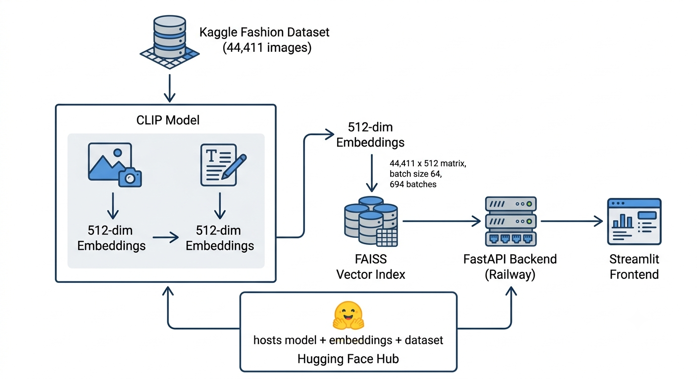

# Fashion Intelligence Engine — Search by Text, Refine by Image

A multimodal fashion product search engine built with CLIP, FAISS, FastAPI, and Streamlit.

## Live
- API: https://fashion-intelligence-engine.up.railway.app/docs
- UI: https://fashion-intelligence-engine.streamlit.app

## Dataset
- [Fashion Product Images Dataset (Kaggle)](https://www.kaggle.com/datasets/paramaggarwal/fashion-product-images-dataset)

## Overview

A multimodal fashion search engine that lets users search naturally ("red floral dress for summer wedding") and get visually matched results, or refine results by uploading a photo. Built on CLIP + FAISS for semantic search, with automatic filter extraction, explainable matches, and a fine-tuned model validated through rigorous evaluation (K-Fold, Optuna tuning, category-wise accuracy analysis).

## Workflow

  

## Workflow & Key Technical Decisions

**Data preparation:** Cleaned the Kaggle Fashion Product Images dataset (~44,411 products)

**Embedding generation:** Used pretrained CLIP (ViT-B/32) to generate 512-dimensional embeddings for all product images, indexed with FAISS (IndexFlatIP) for fast cosine-similarity search.

**Hyperparameter optimization:** This produced a genuine, validated improvement — K-Fold accuracy rose from 0.941 (pretrained baseline) to 0.960–0.963 — and was adopted as the production model.

**Evaluation:** Validated the final model using:

- **Stratified K-Fold Cross-Validation** — ensures balanced representation across product categories during testing
- **Top-1 Accuracy: `0.949`** — correct match ranked as the single best result
- **Top-5 Accuracy: `0.999`** — correct match found within the top 5 results (mixed-category samples)

**Query understanding & explainability:** Built a rule-based parser to extract filters (price, color, category, gender) from natural-language queries, paired with an explainability module.

**Multimodal refinement:** Implemented image + text fusion (weighted embedding blend) to support "more like this, but in blue"-style refinement search.

**Deployment:** Packaged the system as a FastAPI backend (deployed on Railway) with model and embeddings hosted on Hugging Face Hub, paired with a Streamlit frontend for an end-to-end usable demo.

**Category-wise Accuracy** Accuracy varied significantly by category — highest for T-shirts (0.94), likely due to their visually distinctive designs, colors, and patterns. Lowest for Sunglasses (0.44), likely because most sunglasses look visually similar (dark lenses, black frames) and are often described with generic, overlapping captions — making them harder for the model to tell apart using image-text matching alone

## Limitations

- Synthetic pricing: The dataset lacks real pricing data; prices were generated using category-informed ranges purely to demonstrate filtering functionality.

- Contrastive fine-tuning of CLIP was tested on a 5,000-image subset, but it was computationally expensive (1 epoch took ~30 minutes, while effective training would require at least 10–20 epochs on the full 44K-image dataset). Therefore, the final model uses a pretrained CLIP backbone with Optuna hyperparameter tuning (using K-fold cross-validation), offering a practical balance between performance, training time, and computational cost.

- Rule-based parsing (chosen): Fast, free, and deterministic — though limited to phrasing patterns it explicitly recognizes.

- LLM-based parsing (alternative): Handles ambiguous, natural phrasing more robustly — at the cost of latency, per-query expense, and less predictable output.

## Embedding Visualization

  

## Tech Stack

- Python
- CLIP
- PyTorch
- FAISS
- Optuna
- scikit-learn
- FastAPI
- Streamlit
- Hugging Face Hub
- Railway
- Matplotlib
- Pandas
- NumPy
